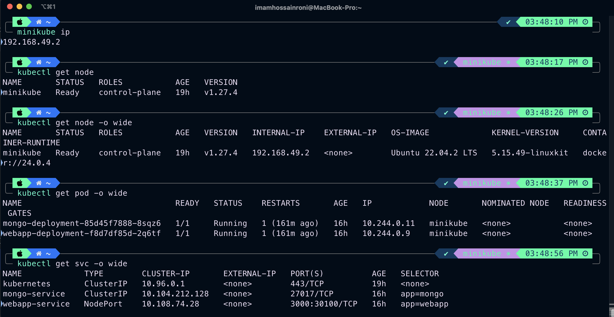

### Play with k8s:


#### K8s manifest files 
* mongo-config.yaml
* mongo-secret.yaml
* mongo.yaml
* webapp.yaml


##### Start Minikube with the HyperKit driver:
```shell
    minikube start --vm-driver=hyperkit 
```
##### Start Minikube with the Docker driver:
```shell
    minikube start --driver docker 
```
##### Check Minikube  status
```shell
    minikube status
```

##### Minikube Node IP:
```shell
    minikube ip
```

##### Get Basic info about k8s components:
```shell
   kubectl get node
   kubectl get pod
   kubectl get svc
   kubectl get all
```
##### Get Extended info about k8s components:
```shell
  kubectl get pod -o wide
  kubectl get node -o wide
```

##### Get details info about a specific components:
```shell
  kubectl describe svc {svc-name}
  kubectl describe pod {pod-name}
```

##### Get application logs:
```shell
   kubectl logs {pod-name}
```

##### Stop Minikube:
```shell
   minikube stop
```

<br />

 >  **Known issue - Minikube IP not accessible** 

If you can't access the NodePort service webapp with `MinikubeIP:NodePort`, execute the following command:

<br />

```shell
   minikube service webapp-service
```
   